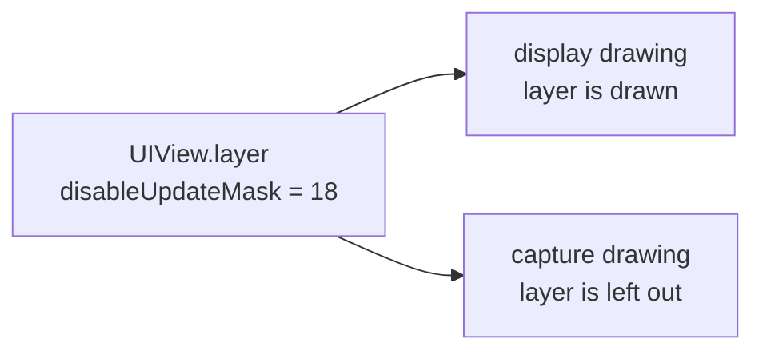
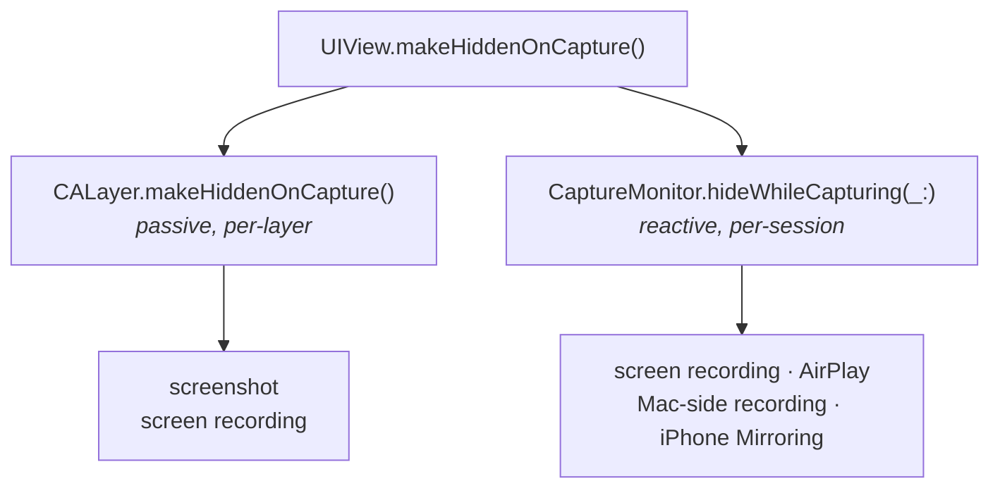
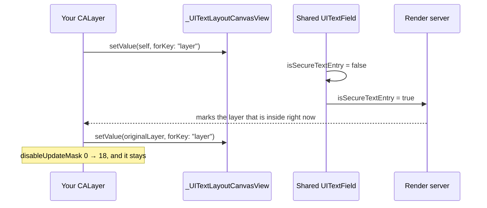
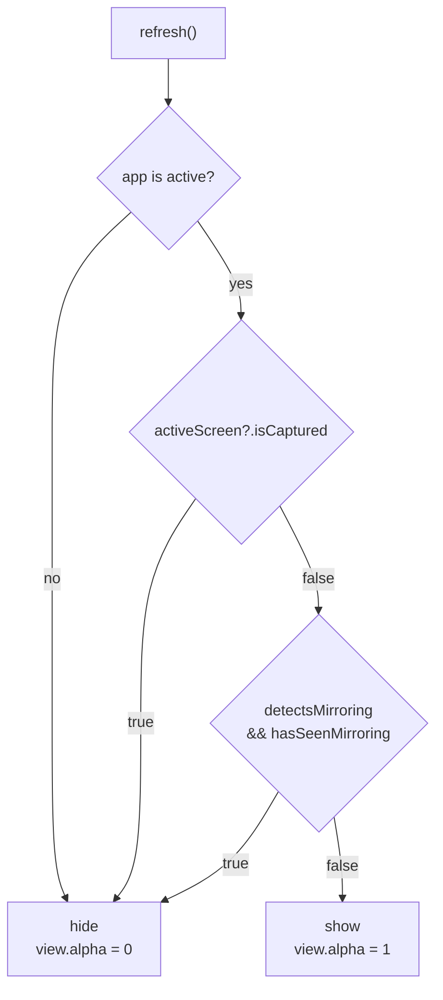
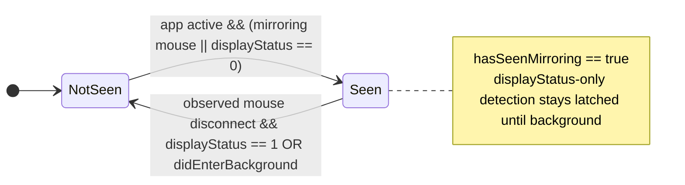
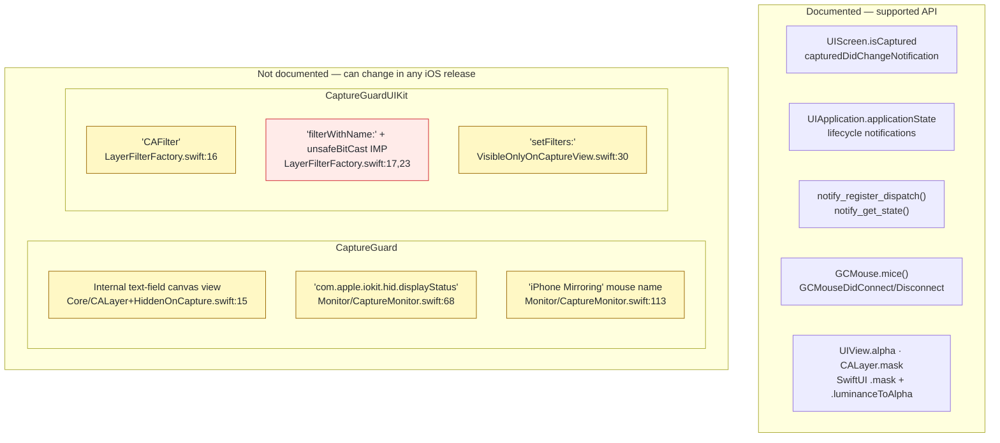

# How it works

## The idea

iOS draws the screen twice. One drawing goes to the display. The other goes to whatever is
capturing it. A layer can be marked so it is left out of the second drawing.



## Two mechanisms

A screenshot takes one frame, right now. There is no event to react to, so the layer has
to be marked before it happens.

A recording or a mirroring session lasts a while. The app can see it start and hide the
view until it ends.

CaptureGuard does both.



`CaptureMonitor` keeps registered views weakly. Each view has a computed property backed by
an associated object for the alpha saved when hiding starts. The monitor sets `alpha` to 0,
then restores and clears the saved value when hiding ends. A saved value of `0` is preserved
too.

## 1. The layer exclusion

A `UITextField` with `isSecureTextEntry` on hides its own text from captures. iOS does
this by leaving one internal layer out of the capture drawing.

There is no public API to ask for that. So the trick is to put your layer inside that text
field for a moment, let iOS mark it, then put the field's own layer back.



The change from `false` to `true` is what does the work. iOS marks whichever layer is
inside the field at that moment, and at that moment it is yours. The field stays secure
after the first call, so setting `true` again would change nothing. That is why the code
sets `false` first.

The KVC calls use the public key-value coding API. The dependency that can change is the
secure text field's internal canvas view and its role in capture rendering.

To check it worked, on a device:

```
(lldb) po myView.layer.value(forKey: "disableUpdateMask")   // 18 = applied, 0 = it did nothing
```

Four things to know:

- Calling it more than once is safe.
- It survives a frame change and `removeFromSuperview()`.
- Only the layer you call it on gets the mark — a sublayer reads `0`. A capture still
  leaves out that layer and everything drawn inside it, so a container protects its
  contents.
- The Simulator sets the mark and then ignores it.

## The mask

`visibleOnlyOnCapture()` is the same trick, turned around.

A mask turns brightness into opacity. White parts of the mask show the content. Black
parts hide it.

Both modifiers build the mask from two layers. One is normal. The other is capture-hidden.
In a capture the capture-hidden one is gone, so the mask flips.

| | base | capture-hidden layer | on screen | in a capture |
|---|---|---|---|---|
| `hiddenOnCapture()` | `.black` | `.white` | white wins → **visible** | white is gone → **hidden** |
| `visibleOnlyOnCapture()` | `.white` | `.black` | black wins → **hidden** | black is gone → **visible** |

`VisibleOnlyOnCaptureView` builds the same mask in Core Animation. UIKit has no public
`luminanceToAlpha`, so it has to find the private `CAFilter` class by name.

## 2. The capture monitor

The mark only changes the picture iOS makes. Mirroring ignores it. So `refresh()` decides
`isCapturing` from two things:



The first branch is not about capture. When the app stops being active, iOS takes a
snapshot for the app switcher, and shows it to anyone who opens the switcher. Hiding on
`willResignActive` keeps the secret out of that snapshot. `isCapturing` stays `false`
there, because nothing is capturing — the two states are tracked separately.

`isCaptured` is true for screen recording, AirPlay, and a recording started on a connected
Mac. It is false for iPhone Mirroring — see [iPhone Mirroring](#iphone-mirroring) below.

While the app is in front, `hasSeenMirroring` latches when detection relies on the display
status signal. When the named mirroring mouse was seen, only a disconnect notification for
that same `GCMouse` instance can end the latch. Disconnects from other mice and trackpads do
not affect it.
Going to the background resets it in either case:



The mirroring mouse is the strong one. A session gives the phone the Mac's pointer as a
virtual `GCMouse`, and iOS names it after the feature — so the phone is told outright what
is happening. It is there from the moment the session starts, before anyone clicks.

`displayStatus` is the `com.apple.iokit.hid.displayStatus` notification, read with
`notify_get_state`. `0` means the phone's own screen is off. An app is only in front with
the screen off when something else is driving it.

The display-status fallback has to latch. During mirroring you can press the power button:
the screen turns on, `displayStatus` becomes `1`, and the Mac keeps streaming. If the code
checked only that signal again, it would show the content. When the named mouse is detected,
its `GCMouseDidDisconnect` notification provides an end signal. The monitor checks that
the notification's `GCMouse` object is the same instance it previously observed with a
`vendorName` containing `iPhone Mirroring`. Disconnects from other mice do not affect the
latch. If the phone display is still off or its state is unknown, the monitor keeps content
hidden until a fresh display-status notification reports that the display is on. A matching
mouse reconnect cancels that wait. Once the display is confirmed on, or if it was already
on when the mouse disconnected, the display-status fallback is available for a later
session. An ordinary screen-on event while the mouse is connected does not clear the latch.
If the matching disconnect notification is missed, the latch remains until the app goes to
the background.

There is no public API that reports the mirroring session itself. If iOS removed the named
mouse while mirroring continued with the phone display on, that state is indistinguishable
from a session that ended; this heuristic would show the content. Device measurements so far
show the named mouse remains connected for the whole session.

`refresh()` runs on six `UIApplication` and `UIScreen` notifications, plus the
`displayStatus` callback. It never polls. If one of those is missed, `isCapturing` stays
wrong until the next one arrives.

## iPhone Mirroring

iPhone Mirroring shows your phone on a Mac. **iOS does not call it a capture**, so the
layer mark does nothing there. Content that is missing from a real screenshot shows up in
full in the mirrored window.

### What Apple says

Neither capture API reacts to it, and that is on purpose. A UIKit engineer on Apple
Developer Forums thread 762684 was asked why `sceneCaptureState` stays `inactive` under
iPhone Mirroring:

> This is expected. iPhone Mirroring is not treated as screen recording, but if you start a
> screen recording session on your Mac, you should see the capture state updated to match
> that.

DTS on thread 759314 was asked if an app can tell that it is being mirrored:

> There isn't a way to explicitly check for that case. I can't think of ways that you might
> work this out implicitly, but that isn't a good idea because such things can change over
> time.

The feature request that came out of it (FB14287821) was closed with no plans to fix it.

### Measured on a device

iPhone 13 Pro, iOS 26.5.2, while mirroring was running:

| Signal | Value | Useful? |
|---|---|---|
| `UIScreen.isCaptured` | `false` | no |
| `UITraitCollection.sceneCaptureState` | `.inactive` | no |
| `UIApplication.applicationState` | `.active` | half — see below |
| `GCMouse` vendor name | `"V-iPhone Mirroring Mouse"` | **yes** |
| `com.apple.iokit.hid.displayStatus` | `0` screen off, `1` after waking it | **yes** |
| `UITouch.type` | `.indirectPointer` for a Mac click, `.direct` for a finger | partly |
| `UIScreen.brightness` | `0.0`, but `1.0` when locked at full brightness | no |
| `com.apple.springboard.lockstate` | `1` in one session, `0` in another | no |
| `GCKeyboard` vendor name | `"Generic Keyboard"` — same as a real one | no |
| `AVAudioSession` output route | `Speaker` either way | no |

### Signals that did not work

- **`UIScreen.brightness == 0`.** This returns the user's brightness setting, not whether
  the screen is on. Lock the phone at full brightness and it still reads `1.0`, so the
  check never fires.
- **`com.apple.springboard.lockstate == 1`.** It reads fine (`notify_get_state` returns
  `0` for OK), but it said `1` in one mirroring session and `0` in another. A signal that
  changes inside one session is worse than no signal.
- **`GCKeyboard.coalesced != nil`.** Mirroring does forward the Mac's keyboard, and this
  caught sessions the screen check missed. But it cannot tell that keyboard from a real
  one: both report the vendor name `Generic Keyboard`. Anyone with a Bluetooth keyboard
  paired to their phone had content hidden the whole time.
- **The audio route.** Mirroring plays the phone's audio on the Mac, but the phone still
  reports `Speaker` either way.

### What it uses instead

```swift
guard isActive else { return false }

// iOS names this device after the feature.
if GCMouse.mice().contains(where: { $0.vendorName?.contains("iPhone Mirroring") == true }) {
    return true
}
if let isDisplayOn = displayStatus?.state, isDisplayOn == 0 { return true }
if displayStatus == nil { return activeScreen.brightness <= 0.001 }   // fallback only
return false
```

`GCMouse` is public API from GameController, and the mouse exists for the whole session, so
this one holds while the phone's own screen is awake — which the screen check cannot do. The
vendor *name* is not documented, and that is the risky part.

`displayStatus` comes from the Darwin notification API in `<notify.h>`, reached through the
`CNotify` target. `notify_get_state` is public. Its *name* is not documented either. It stays
as a second signal in case the first one changes.

The guess is off in the Simulator. There is no real screen there, so the notification is
never posted and its state stays `0` — which would look like a mirroring session that
never ends.

To turn it off completely: `CaptureMonitor.shared.detectsMirroring = false`.

### Testing it again after an iOS update

This is a guess, and it has broken twice already. Run the sample on a device and check all
five:

1. Mirror the phone → the content hides.
2. Press the power button during the session, without unlocking → it stays hidden.
3. Set brightness to full, lock the phone, then mirror → it hides.
4. Unlock the phone to end the session → the content comes back.
5. Lock and unlock the phone with no mirroring → the content comes back.
6. Pair a Bluetooth keyboard or mouse to the phone, with no mirroring → the content stays
   readable. This is the false-positive check.

## Limits

Read this before you ship. Most failures here are silent: the content stays visible and
nothing is logged.

### Nothing tells you when it breaks

There is no logging, no assert, and no error anywhere in `Sources/`. If a lookup fails,
`makeHiddenOnCapture()` returns normally and does nothing.

This is not theory. The first commit shipped `hiddenOnCapture()` with the capture-hidden
layer commented out. It protected nothing, there was no compile error, and the screen
looked the same. It was found a day later.

### What breaks on an iOS update

Here is everything the package touches, split by whether Apple documents it. The
documented half is stable. The other half is eight strings, and any of them can change
without warning.



**Yellow** goes quiet: the lookup misses, the content stays visible, nothing is logged.
**Red** throws an Objective-C exception instead. The `unsafeBitCast` call assumes a function
signature that nothing checks.

`LayerFilterFactory` is uneven about this. It guards the class and method *lookups* with
`guard let`, but not the *call*. So a missing class is safe and a changed signature is not.

Test on a device after every iOS release — see
[the checklist](#testing-it-again-after-an-ios-update).
